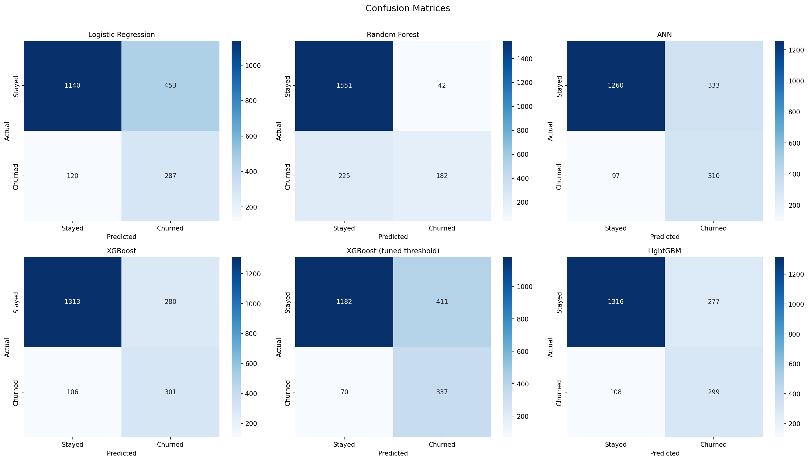
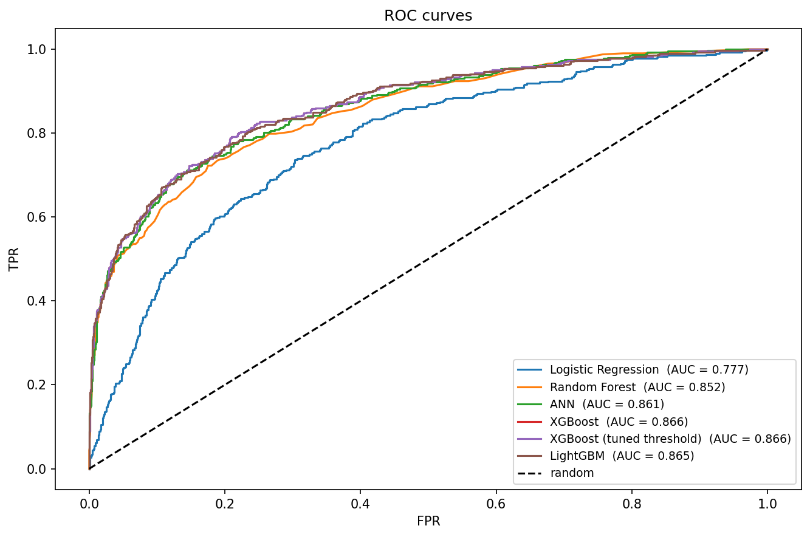
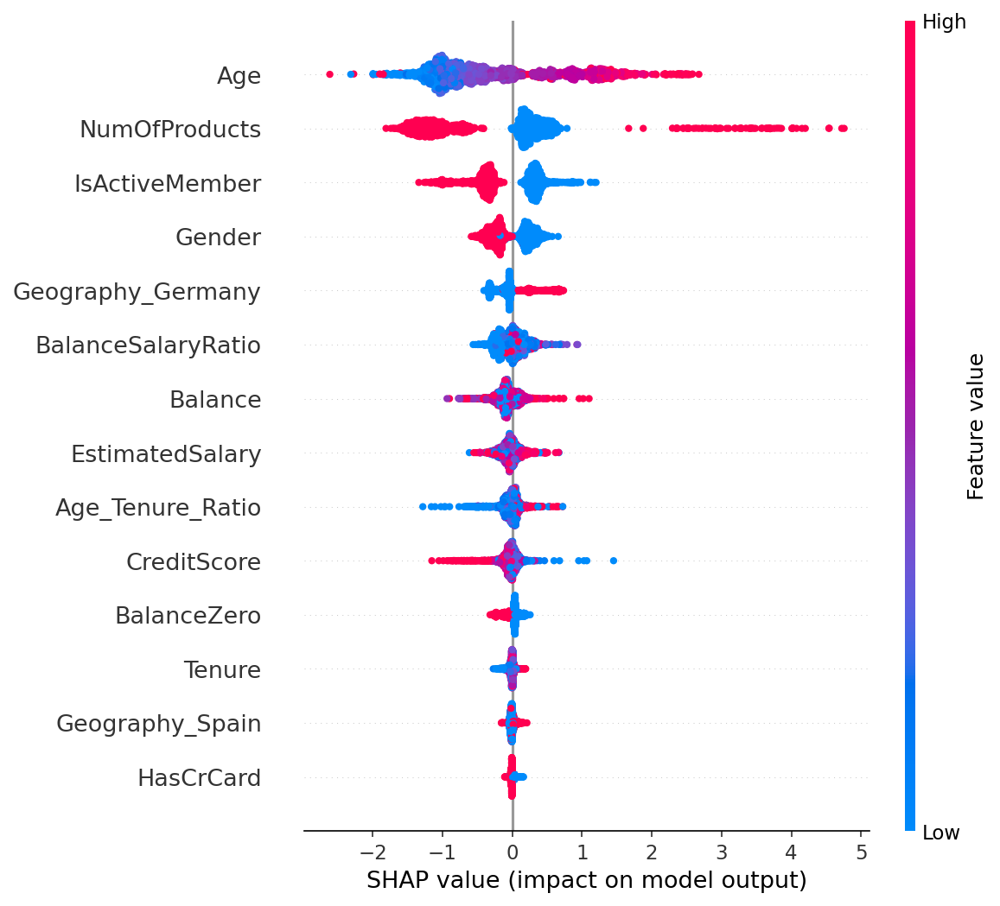
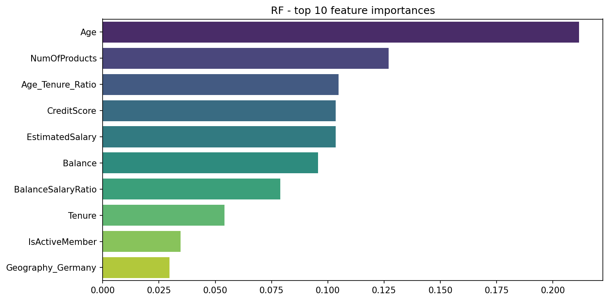

# Bank Customer Churn Prediction

End-to-end ML project on 10,000 bank customers. Covers the full pipeline from EDA to model explainability, comparing six different approaches including an Artificial Neural Network.

---

## Dataset

- **Source**: [Kaggle — Churn Modelling](https://www.kaggle.com/datasets/shubh0799/churn-modelling/data)
- **Size**: 10,000 rows × 14 features
- **Target**: `Exited` — binary (0 = stayed, 1 = churned)
- **Class balance**: ~80% / 20% (moderate imbalance)

**Features**: CreditScore, Geography, Gender, Age, Tenure, Balance, NumOfProducts, HasCrCard, IsActiveMember, EstimatedSalary

---

## Project Structure

```
├── Churn Modelling.ipynb      # Main notebook
├── Churn_Modelling.csv        # Dataset (not committed, download from Kaggle)
├── images/                    # Plots saved by the notebook
│   ├── confusion_matrix.png
│   ├── roc_curves.png
│   ├── feature_importance_rf.png
│   ├── shap_importance.png
│   ├── shap_beeswarm.png
│   └── threshold_tuning.png
├── requirements.txt
├── .gitignore
└── README.md
```

---

## Pipeline Overview

| Step | What and why |
|---|---|
| **EDA** | Distributions, class balance, correlations, segment analysis |
| **Data Cleaning** | Null check, duplicate check |
| **Feature Engineering** | `BalanceZero`, `BalanceSalaryRatio`, `Age_Tenure_Ratio` |
| **Preprocessing** | Label encoding (Gender), one-hot encoding (Geography), StandardScaler |
| **Train/Test Split** | 80/20, stratified — preserves the class ratio in both sets |
| **Modelling** | 6 models (see below) |
| **Evaluation** | Confusion matrices, ROC curves, summary table sorted by Recall |
| **Explainability** | SHAP values on XGBoost |

**Note on validation**: no explicit validation set. With 10K rows a 3-way split wastes too many training samples. The ANN uses `validation_split=0.2` from the training fold exclusively for Early Stopping — the test set is never touched during training.

**Note on SMOTE**: not used. With 80/20 imbalance, `class_weight='balanced'` and `scale_pos_weight` are sufficient. SMOTE is appropriate for severe imbalance (e.g. 99/1).

---

## Models

| Model | Class imbalance handling |
|---|---|
| Logistic Regression | `class_weight='balanced'` |
| Random Forest | `class_weight='balanced'` |
| ANN (TF/Keras, 3 hidden layers) | `class_weight={0:1, 1:4}` + Dropout + BatchNorm |
| XGBoost | `scale_pos_weight` (ratio negative/positive) |
| LightGBM | `class_weight='balanced'` |
| XGBoost + Threshold Tuning | Optimal threshold maximising Recall subject to Precision ≥ 0.45 |

---

## Results

> **Primary metric: Recall on Churned class.**  
> Missing a churner (False Negative) is far more costly than a wasted retention offer (False Positive).

| Model | Accuracy | Precision | **Recall ↑** | F1 | ROC-AUC |
|---|---|---|---|---|---|
| **XGBoost (tuned threshold)** | 0.7595 | 0.4505 | **0.8280** | 0.5835 | 0.8661 |
| ANN | 0.7750 | 0.4680 | 0.7715 | 0.5826 | 0.8600 |
| XGBoost | 0.8070 | 0.5181 | 0.7396 | 0.6093 | **0.8661** |
| LightGBM | 0.8075 | 0.5191 | 0.7346 | 0.6083 | 0.8650 |
| Logistic Regression | 0.7135 | 0.3878 | 0.7052 | 0.5004 | 0.7768 |
| Random Forest | **0.8665** | **0.8125** | 0.4472 | 0.5769 | 0.8519 |

**Key observation**: Random Forest achieves the highest Accuracy (0.867) and Precision (0.813), yet has the **lowest Recall (0.447)** — it misses more than half of all churners. This is a textbook example of why Accuracy is a misleading metric under class imbalance.

---

## Preview

| Confusion Matrices | ROC Curves |
|---|---|
|  |  |

| SHAP Feature Impact | RF Feature Importance |
|---|---|
|  |  |

*Images are generated automatically when running the notebook end to end.*

---

## Key Findings from EDA

- **Age** is the strongest predictor: churners tend to be significantly older
- **Germany** shows a disproportionately high churn rate vs France and Spain
- **Inactive members** (`IsActiveMember=0`) churn ~twice as often as active ones
- Customers with **2+ products** show very high churn despite being cross-sold
- Customers with **zero balance** represent a distinct at-risk segment

---

## What I Would Still Explore

- `StratifiedKFold` cross-validation for more robust metric estimates
- Hyperparameter tuning with `Optuna` on XGBoost / LightGBM
- `CalibratedClassifierCV` to ensure predicted probabilities are reliable
- SHAP-driven feature selection to simplify the model

---

## Tech Stack

| Library | Version |
|---|---|
| Python | 3.9 |
| pandas | 2.x |
| scikit-learn | 1.6 |
| TensorFlow / Keras | 2.20 |
| XGBoost | 2.1 |
| LightGBM | 4.6 |
| SHAP | 0.49 |
| seaborn / matplotlib | — |

---

## How to Run

```bash
# 1. Clone the repo
git clone https://github.com/MattiaToffolo/bank-churn-prediction.git
cd bank-churn-prediction

# 2. Install dependencies
pip install pandas numpy scikit-learn tensorflow xgboost lightgbm shap seaborn matplotlib jupyter

# 3. Open the notebook
jupyter notebook "Churn Modelling.ipynb"
```

Run cells top to bottom. The ANN training (~100 epochs with Early Stopping) takes 1–2 minutes depending on hardware.

---

## Author

**Mattia Toffolo**  
[LinkedIn](https://www.linkedin.com/in/mattia-toffolo/) · [GitHub](https://github.com/MattiaToffolo)